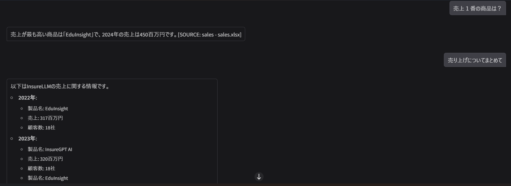
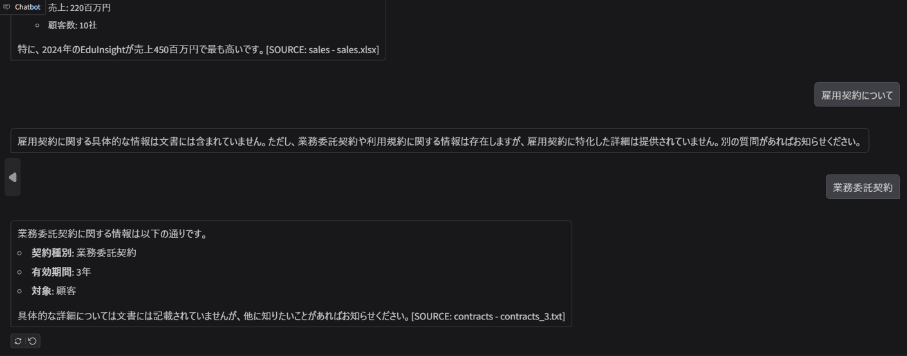

## InsureLLM RAG QA Assistant 🧠
このプロジェクトは、Retrieval-Augmented Generation (RAG) を用いて、保険会社「Insurellm」に関するドキュメントから質問に答えるチャットアシスタントを構築します。LangChain、ChromaDB、OpenAIモデルを組み合わせて、指定されたドキュメントに基づいて正確かつ文脈に沿った回答を提供します。

## 主な機能 ✨
-複数のドキュメント形式のサポート: PDF, DOCX, XLSX, TXT, Markdown (.md) ファイルを処理できます。

-効率的なデータ処理: ドキュメントを小さなチャンクに分割し、重複排除と一意のID付けを行います。

-ベクターデータベースの管理: ChromaDBを使用して、ドキュメントチャンクの埋め込みを永続化し、新しいドキュメントが追加された場合にのみデータベースを再構築します。

-ベクターデータの可視化: t-SNEアルゴリズムを使用して、高次元のドキュメント埋め込みを2Dまたは3D空間で視覚化し、データポイントの関係性を理解するのに役立ちます。

-高度な検索: 検索されたドキュメントの関連性スコアに基づいてフィルタリングするカスタムリトリーバーを実装しています。

-会話履歴対応: ユーザーの過去の会話履歴を考慮して、関連性の高いドキュメントを検索し、文脈に沿った回答を生成します。

-Gradioインターフェース: 簡単で直感的なWebベースのチャットインターフェースを提供し、アシスタントと対話できます。


## セットアップ ⚙️
-前提条件 ✅

Python 3.9以上

OpenAI APIキー


-インストール ⬇️

必要なライブラリをインストールします。

```bash

pip install -r requirements.txt
requirements.txtの内容は以下の通りです。

langchain-core>=0.1.20
langchain-community>=0.0.21
langchain-openai>=0.1.3
langchain-chroma>=0.1.3
langgraph>=0.0.20
pypdf
docx2txt
unstructured[all-docs]
msoffcrypto-tool
openpyxl
tiktoken>=0.5.1
numpy
scikit-learn
pydantic>=2.0
python-dotenv>=1.0.0
plotly
gradio==4.13.0
openai>=1.0.0
anthropic
pandas>=2.0.0
langchain>=0.1.13
huggingface_hub>=0.20.0
chromadb>=0.4.14

```
## 環境設定 🔑

プロジェクトのルートディレクトリに.envファイルを作成し、OpenAI APIキーを設定します。

```bash
OPENAI_API_KEY="your_openai_api_key"
```
## データディレクトリの準備 📁

処理したいドキュメントを格納するためのデータディレクトリを作成し、DATA_PATHを設定します。

例:

```Python

DATA_PATH = r"path/to/your/documents"
```
ドキュメントは、このパス内のサブディレクトリに配置できます。これにより、各ドキュメントのメタデータとしてdoc_typeが自動的に設定されます。

## 使い方 🚀

スクリプトを実行する前に、your-data-pathを実際のドキュメントディレクトリのパスに置き換えてください。

スクリプトを実行します。

```Bash

python rag_qa_assistant.py
```
スクリプトは以下の処理を自動的に行います。

your-data-pathにあるドキュメントを読み込み、チャンクに分割します。

ドキュメントチャンクの一意性を確認し、変更があればChromaDBを再構築します。

t-SNEを使用してドキュメント埋め込みの2Dおよび3D可視化を生成し、ブラウザで表示します。

Gradioアプリケーションを起動し、チャットインターフェースが利用可能になります。

## ブラウザで開く 🌐

ターミナルに表示されるローカルURLにアクセスして、Gradioチャットインターフェースを開きます。

アシスタントに質問を入力し、応答を確認します。

## 注意事項 ⚠️
-ドキュメントの正確性: アシスタントの応答は、提供されたドキュメントの品質と内容に厳密に依存します。ドキュメントに情報がなければ、アシスタントは「情報がありません」と回答します。

-APIキーの管理: OPENAI_API_KEYは安全に保管し、バージョン管理システムにコミットしないでください。

-ChromaDB: .envで定義されたパスにChromaDBのベクターデータが保存されます。同じドキュメントセットでスクリプトを再実行しても、データベースが変更されていなければ再構築は行われません。

実行例


