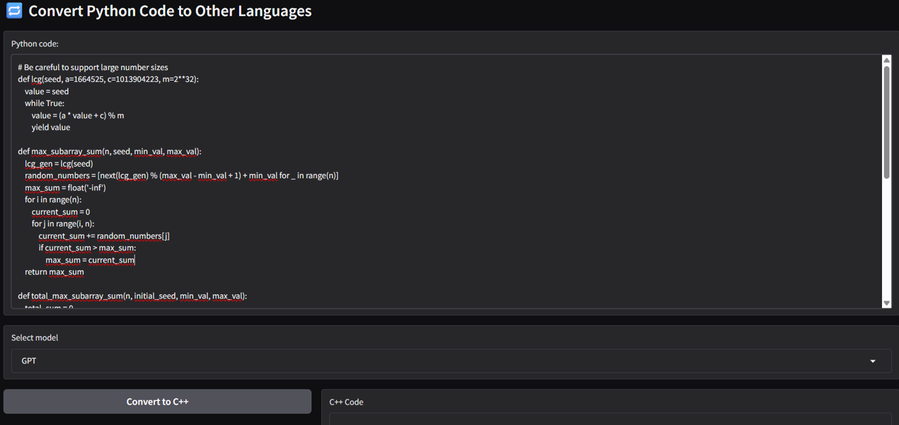
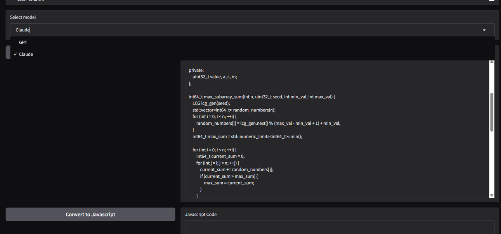

# 🔁 Python コード変換 AI ツール

このプロジェクトは、Python コードを他のプログラミング言語（C++ / JavaScript / PHP）に高速かつ正確に変換する AI ツールです。Gradio による Web UI を通じて、GPT-4o または Claude 3 Haiku を選択し、リアルタイムでコード変換を体験できます。

## 🚀 主な機能

- Python コードを C++ / JavaScript / PHP に変換
- GPT-4o または Claude 3 Haiku による AI 変換
- Gradio UI で簡単操作・即時プレビュー
- コメントは最小限、実行結果の再現性を重視
- 数値型のオーバーフローや互換性も考慮

## 🧠 使用技術

| 技術      | 用途                            |
| --------- | ------------------------------- |
| Gradio    | Web UI 構築                     |
| OpenAI    | GPT-4o モデルによる変換         |
| Anthropic | Claude 3 Haiku モデルによる変換 |
| dotenv    | API キーの環境変数管理          |
| platform  | 実行環境に応じた最適化          |

## 📦 インストール手順

1. 必要なライブラリをインストール：

```bash
pip install -r requirements.txt

- .env ファイルを作成し、APIキーを設定：
OPENAI_API_KEY=your-openai-key
ANTHROPIC_API_KEY=your-anthropic-key

🖥️ 使い方
- 左側のテキストボックスにPythonコードを入力（初期値あり）
- モデル（GPTまたはClaude）を選択
- 変換したい言語のボタンをクリック
- 右側に変換後のコードが表示されます

画面概要



```
