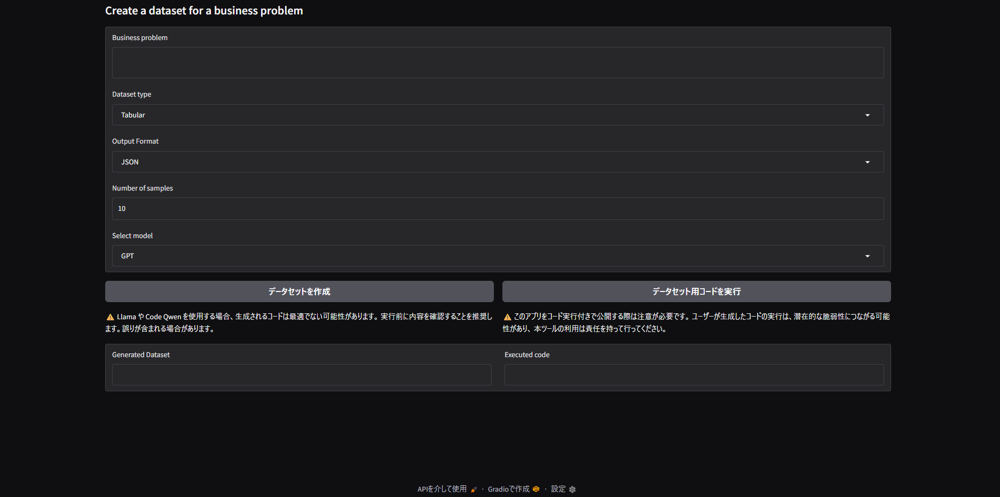
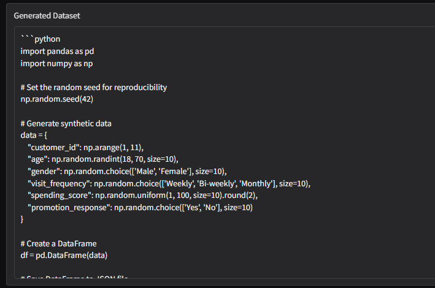

# 📊 合成データ生成 AI ツール

このプロジェクトは、ビジネス課題に応じた合成データセットを自動生成する AI ツールです。  
ユーザーが課題・形式・サンプル数を指定すると、選択した AI モデルが Python コードを生成し、データを保存・実行まで行えます。

## 🚀 主な機能

- ビジネス課題に応じたデータ生成（Tabular / Time-series / Text）
- 出力形式の選択（CSV / JSON）
- GPT-4o, Claude 3.5, LLaMA 3.1, CodeQwen に対応
- Gradio UI による直感的な操作
- 生成された Python コードの即時実行（仮想環境）

## 🧠 使用技術

| 技術         | 用途                        |
| ------------ | --------------------------- |
| Gradio       | Web UI 構築                 |
| OpenAI       | GPT-4o によるコード生成     |
| Anthropic    | Claude 3.5 によるコード生成 |
| HuggingFace  | CodeQwen モデルの呼び出し   |
| Transformers | LLaMA モデルのローカル推論  |
| subprocess   | Python コードの実行         |

## 📦 インストール手順（Google Colab）

1. 必要なライブラリをインストール：

```python
%pip install -q python-dotenv gradio anthropic openai requests torch bitsandbytes transformers sentencepiece accelerate
```
2. Colabの userdata に以下のキーを設定：
```python
OPENAI_API_KEY
ANTHROPIC_API_KEY
HF_TOKEN
```
- スクリプトを実行すると、Gradio UIが表示されます。
🖥️ 使い方
- ビジネス課題を入力（例：「顧客の購買履歴を模擬したデータ」）
- データタイプ（Tabular / Time-series / Text）を選択
- 出力形式（JSON / CSV）を選択
- サンプル数を指定（例：1000）
- モデルを選択（GPT / Claude / Llama / Code Qwen）
- 「Create a dataset」ボタンでコード生成
- 「Execute code for a dataset」ボタンで実行結果を確認

画面概要

例（スーパーマーケットの集客マーケティング施（

```
