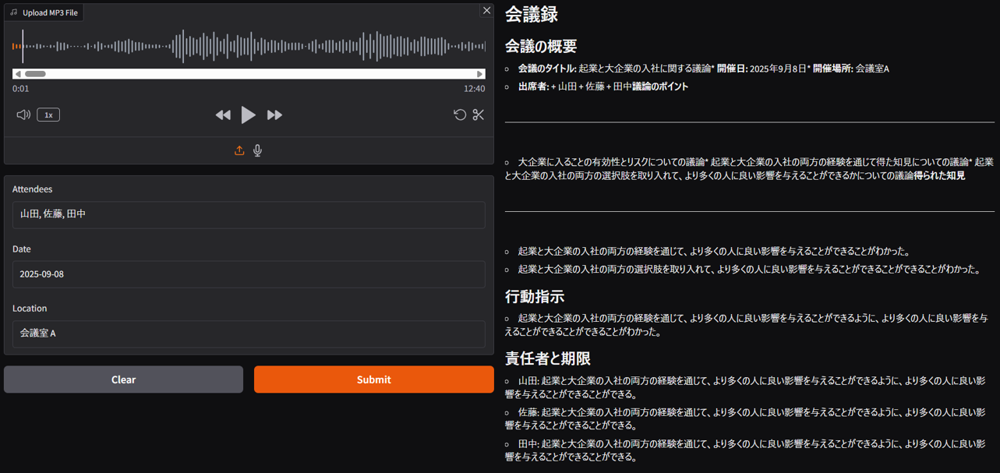
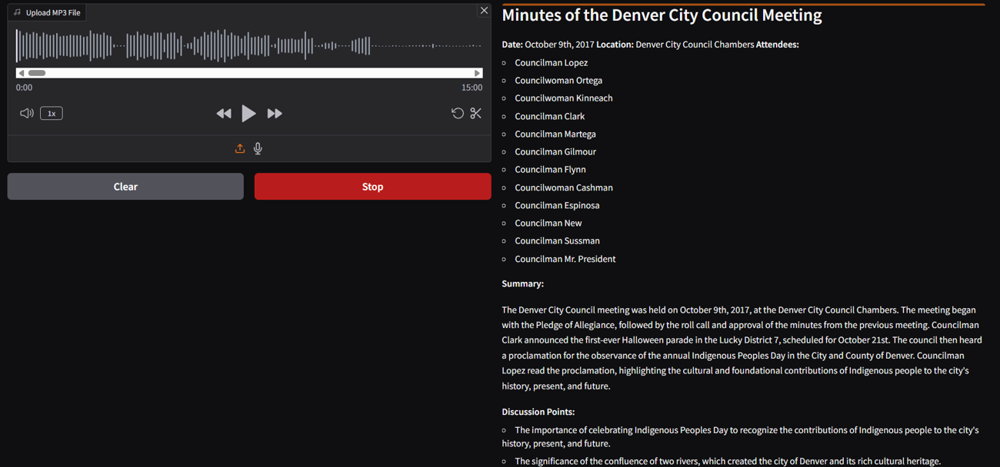

# 📝 AI 議事録アシスタント

このプロジェクトは、会議音声ファイル（MP3）をアップロードするだけで、参加者・日時・場所などの情報をもとに、Markdown 形式の議事録を自動生成する AI ツールです。OpenAI Whisper による音声認識と LLaMA 3.1 による自然言語処理を組み合わせ、構造化された議事録を即座に出力します。

## 🚀 主な機能

- MP3 音声ファイルのアップロードによる自動文字起こし（OpenAI Whisper）
- 会議の参加者・日時・場所を指定可能
- LLaMA モデルによる日本語の議事録生成（Markdown 形式）
- Gradio UI による直感的な操作
- ストリーミング形式でリアルタイムに議事録を表示

## 🧠 使用技術

| 技術           | 用途                           |
| -------------- | ------------------------------ |
| OpenAI Whisper | 音声ファイルの文字起こし       |
| Meta LLaMA 3.1 | 議事録の自然言語生成           |
| Gradio         | Web UI 構築                    |
| Transformers   | モデルのトークナイズと推論処理 |
| BitsAndBytes   | 量子化による高速・軽量推論     |

## 📦 実行方法（Google Colab）

1. 必要なライブラリをインストール：

```python
%pip install -q requests torch bitsandbytes transformers sentencepiece accelerate openai httpx==0.28.1 gradio

2． Colabの userdata に以下のキーを設定：
OPENAI_API_KEY
HF_TOKEN

🖥️ 使い方
- MP3形式の音声ファイルをアップロード
- 参加者・日時・場所を入力（任意）
- 「AI Meeting Assistant」画面で議事録がリアルタイムに生成されます
📄 出力形式（Markdown）
生成される議事録は以下の構成になります：
- 会議概要（タイトル・日時・場所・参加者）
- 議論された主なトピック
- 決定事項・合意内容
- アクションアイテム（担当者・期限付き）

議事録出力例




⚠️ 注意事項
日本語の音声では、参加者や日付、場所に関して誤った出力がみられるため、userプロンプトに追加する処理を追加したが、GPUの性能等の理由で動作未確認の状態

```
